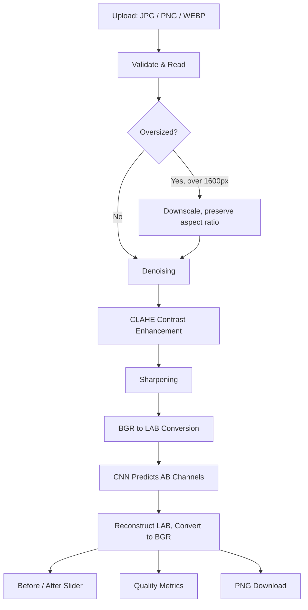

# 🎨 AI Photo Restoration & Colorization Studio

[](LICENSE)
[](https://www.python.org/downloads/)
[](https://github.com/vishalkoripala/opencv-colorization-project/actions/workflows/tests.yml)

Restore, enhance, and colorize photographs using computer vision and deep learning.

---

## Overview

This app turns old, damaged, grayscale, or low-quality photographs into enhanced, colorized images. It combines classical computer vision (denoising, CLAHE contrast enhancement, sharpening) with a CNN-based colorization model, all running through a Streamlit interface with configurable processing stages, an interactive before/after comparison, and processing metrics.

Every restoration stage — denoising, contrast enhancement, sharpening — and colorization itself can be toggled independently, so the app works equally well as a plain restoration tool, a plain colorizer, or both together.

## Demo

🔗 **Live Demo:** *Not yet deployed — add your Streamlit Community Cloud URL here after deploying (see [Deployment](#deployment)).*

## Screenshots

*Pending — add after running the app locally or deploying it. Suggested shots: the upload card with metadata, the sidebar processing controls, the before/after comparison slider mid-drag, and the metrics row.*

## Features

- **Configurable restoration pipeline** — denoising, CLAHE contrast enhancement, and sharpening, each independently toggleable, plus a master "Restoration" switch
- **CNN-based colorization** — the Zhang et al. (2016) colorization network via OpenCV's `dnn` module, with the model downloaded automatically on first use
- **Interactive before/after comparison** — a drag-to-reveal slider, not just a static side-by-side
- **Processing metrics** — resolution, processing time, device (CPU/CUDA, honestly detected), and heuristic sharpness/contrast estimates with before→after deltas
- **Upload validation and metadata** — JPG/PNG/WEBP, corrupted-file handling, automatic downscaling of oversized images with a clear explanation, and a display of filename/resolution/size/mode
- **Batch processing** — upload up to 10 images at once, processed sequentially with live progress and a combined ZIP download
- **53 automated tests** covering the enhancement, colorization, pipeline, image utility, and metrics modules
- **CI** that runs the full test suite on every push and pull request

## Architecture



Denoising, contrast enhancement, sharpening, and AI colorization are each independently toggleable in the sidebar — this diagram shows the full pipeline with everything enabled.

The codebase is a small `src/` package rather than one monolithic script:

- `app.py` — the Streamlit UI: layout, sidebar controls, and the single-image / batch tabs
- `src/colorizer.py` — model loading and the LAB-space colorization inference
- `src/enhancer.py` — denoise / CLAHE contrast / sharpen, each independently callable
- `src/pipeline.py` — orchestrates enhance + colorize + timing; shared by both single-image and batch modes
- `src/image_utils.py` — resizing, base64 encoding, the comparison-slider HTML builder, batch-results ZIP bundling
- `src/metrics.py` — heuristic quality metrics and CPU/CUDA device detection
- `src/model_downloader.py` — fetches the model weights on first use
- `src/config.py` — every constant and file path in one place

## How It Works

1. **Image preprocessing** — the upload is validated, converted to a NumPy array, and downscaled if it exceeds 1600px on the longest side
2. **Classical restoration** — non-local means denoising, CLAHE contrast enhancement, and a unity-gain sharpening kernel, each optional
3. **LAB conversion** — the restored image is converted to LAB color space and its L (lightness) channel is isolated
4. **CNN prediction** — a CNN, given only the L channel, predicts the A and B (color) channels
5. **AB channel generation** — the network outputs a probability distribution over 313 quantized color bins, which gets converted to concrete A/B values
6. **Image reconstruction** — the predicted A/B channels are recombined with the original L channel and converted back to BGR for display and download

This structure exists specifically so the project is explainable, not just functional — each stage above is a real, separable step in the code.

## Computer Vision Pipeline

The classical (non-learned) restoration stages, in order:

| Stage | Technique | Purpose |
|---|---|---|
| Denoising | `cv2.fastNlMeansDenoisingColored` | Removes sensor/scan noise while preserving edges |
| Contrast | CLAHE on the L channel only (LAB space) | Boosts local contrast without shifting color/saturation |
| Sharpening | Unity-gain Laplacian kernel | Restores edge definition lost to denoising, without inflating brightness |

Each stage is a standalone function in `src/enhancer.py`, independently unit-tested and independently toggleable from the UI.

## AI Colorization

Colorization uses the pretrained network from **Zhang, Isola, and Efros, "Colorful Image Colorization," ECCV 2016** — loaded via OpenCV's `cv2.dnn` module rather than a full deep learning framework, so the only heavy dependency is OpenCV itself.

The model predicts a distribution over 313 quantized `(a, b)` color bins for every pixel, conditioned only on the L (lightness) channel — it has no access to the original color, by construction, since the whole point is to hallucinate plausible color for images that don't have any. Model loading is separated from inference (`load_model()` / `colorize(image, net)`) so the model can be cached by Streamlit and swapped for a stub in tests.

## LAB Color Space

The pipeline works in LAB rather than RGB because LAB cleanly separates the information the model needs from the information it must preserve:

```text
L = Lightness       (0-100, preserved exactly from the input)
A = Green ↔ Red     (predicted by the CNN)
B = Blue ↔ Yellow   (predicted by the CNN)
```

Because L is carried through untouched, the network only has to predict color — it can't accidentally distort the brightness or detail already present in the photo. This is also why the restoration stages (denoise/contrast/sharpen) run *before* colorization: they operate on the image that becomes the L channel, so their effects are preserved through to the final output.

## Technology Stack

- **Python 3.12**
- **OpenCV** (`opencv-python-headless`) — image processing and the `dnn` inference module
- **NumPy** — array operations throughout the pipeline
- **Streamlit** — the web UI
- **Pillow** — image I/O and format handling
- **pytest** — the test suite
- **GitHub Actions** — CI

## Project Structure

```text
opencv-colorization-project/
│
├── app.py
│
├── src/
│   ├── __init__.py
│   ├── colorizer.py
│   ├── enhancer.py
│   ├── pipeline.py
│   ├── image_utils.py
│   ├── metrics.py
│   ├── model_downloader.py
│   └── config.py
│
├── model/
│   ├── colorization_deploy_v2.prototxt
│   ├── pts_in_hull.npy
│   └── colorization_release_v2.caffemodel   (downloaded on first use, not committed)
│
├── tests/
│   ├── conftest.py
│   ├── test_colorizer.py
│   ├── test_enhancer.py
│   ├── test_pipeline.py
│   ├── test_image_utils.py
│   └── test_metrics.py
│
├── .github/
│   └── workflows/
│       └── tests.yml
│
├── pyproject.toml
├── requirements.txt
├── README.md
├── LICENSE
└── .gitignore
```

## Installation

### 1️⃣ Clone the repository

```bash
git clone https://github.com/vishalkoripala/opencv-colorization-project.git
cd opencv-colorization-project
```

### 2️⃣ Create and activate a virtual environment

```bash
python -m venv .venv
```

macOS / Linux:
```bash
source .venv/bin/activate
```

Windows:
```bash
.venv\Scripts\activate
```

### 3️⃣ Install dependencies

```bash
pip install -r requirements.txt
```

## Model Setup

The two small model files (`colorization_deploy_v2.prototxt`, `pts_in_hull.npy`) are committed to this repo. The pretrained weights (`colorization_release_v2.caffemodel`, ~123MB) are not, due to GitHub's file size limits.

**Automatic (default):** the app downloads the weights itself the first time you click "Restore & Colorize" with AI Colorization enabled, from the [official release](http://eecs.berkeley.edu/~rich.zhang/projects/2016_colorization/files/demo_v2/colorization_release_v2.caffemodel) (the same source OpenCV's own documentation points to). You'll see a progress bar; the file is then cached in `model/` for the rest of that run.

**Manual (fallback):** if your network blocks that download, fetch the file yourself from the link above and place it in:

```bash
model/
```

The app will pick it up automatically on the next run.

## Running Locally

```bash
streamlit run app.py
```

## Usage

1. **Upload** a JPG, PNG, or WEBP photo — the app shows its filename, resolution, file size, and original mode
2. **Choose processing options** in the sidebar: toggle Restoration (and its Denoising/Contrast/Sharpening sub-stages) and AI Colorization independently
3. Click **✨ Restore & Colorize**
4. **Compare** the result against the original with the drag-to-reveal slider
5. Review the **metrics row**: resolution, processing time, device, and sharpness/contrast deltas
6. **Download** the result as a PNG

For multiple photos at once, switch to the **Batch Processing** tab, upload up to 10 images, and click **Process All** — see [Batch Processing](#batch-processing).

## Batch Processing

The **Batch Processing** tab accepts multiple images at once (capped at `MAX_BATCH_FILES = 10` to bound memory and processing time), runs them sequentially through the same pipeline as single-image mode, and shows live progress ("3 / 5 processed"). A file that fails (corrupted, unreadable) is skipped with a reported error rather than aborting the whole batch — the rest still process normally. Results come with both individual downloads and a combined "Download All as ZIP" button.

## Testing

```bash
pytest
```

53 tests across `enhancer`, `colorizer`, `pipeline`, `image_utils`, and `metrics`, using a stub network for colorization tests so the suite doesn't need the real ~123MB model. Covers: toggle independence, output shape/dtype/range, error paths (missing model files, corrupted uploads), the specific regressions this project fixed along the way (sharpen-kernel brightness inflation, the LAB clip), and the metric heuristics against images with known relationships.

GitHub Actions (`.github/workflows/tests.yml`) runs this suite, plus a syntax check, on every push and pull request.

## Deployment

### Streamlit Community Cloud

1. Push this repo to a **public** GitHub repository (required for the free tier).
2. Go to [share.streamlit.io](https://share.streamlit.io) and sign in with GitHub.
3. Click **New app**, select this repo and branch, and set the main file to `app.py`.
4. Deploy. Streamlit installs from `requirements.txt` automatically.

The model downloads itself the first time a visitor runs colorization (see [Model Setup](#model-setup)), so nothing needs to be uploaded manually.

**Known platform limits, worth knowing before you deploy:**
- Free-tier apps get roughly 1GB of memory — the `MAX_IMAGE_DIMENSION` cap in `src/config.py` (1600px) is partly there to keep large-image processing within that budget.
- Apps sleep after 12 hours without traffic and wake on the next visit.
- The automatic model download may not be strictly "one-time": Community Cloud's free tier doesn't guarantee the filesystem survives a sleep/wake cycle or a redeploy, so the ~123MB download can recur after the app's been asleep. The progress bar and graceful fallback make this a non-issue functionally, but it's worth setting expectations correctly.

### Other hosts

Any host that runs standard Python + `pip install -r requirements.txt` + `streamlit run app.py` works the same way — Render, Railway, Fly.io, a VPS, or your own machine. Model paths in `src/config.py` are resolved relative to the file itself, not the working directory, so there's nothing host-specific to configure.

## Limitations

- **CPU-only in typical deployment** — `opencv-python-headless` ships without CUDA support, so inference runs on CPU; a single image takes a few seconds
- **Heuristic metrics, not calibrated scores** — sharpness and contrast use standard proxies (Laplacian variance, pixel std. dev.), not a reference-based measure like PSNR/SSIM, since there's no ground-truth image to compare against
- **Batch limit** — capped at 10 images per batch to bound memory and processing time on a CPU-only deployment
- **General-purpose colorization model** — the 2016 Zhang et al. network isn't fine-tuned for any particular photo era, damage type, or subject matter, so results vary
- **Model download depends on outbound network access** to the hosting domain; the manual-placement fallback exists for restricted environments
- **1600px processing cap** — very large images are downscaled before processing to keep CPU processing time reasonable

## Future Improvements

1. **Faster CPU inference** — an ONNX Runtime or OpenVINO backend for the colorization network, which typically outperforms OpenCV's `dnn` module on CPU
2. **Damage-specific restoration** — scratch and crease removal via `cv2.inpaint`, aimed specifically at physically damaged prints rather than general noise
3. **Reference-based quality comparison** — when a ground-truth or professionally-restored reference image is available, add real PSNR/SSIM metrics alongside (not instead of) the current heuristics
4. **A more modern colorization model** — several post-2016 approaches produce more saturated, more plausible color; swapping the model is straightforward given the `load_model()` / `colorize(image, net)` split
5. **Parallel batch processing** — the current batch mode processes sequentially; a bounded worker pool would speed up multi-image runs without giving up the memory limits that sequential processing makes easy to reason about

## Contributing

1. Fork the repository
2. Create a feature branch (`git checkout -b feature/your-idea`)
3. Make your changes, and run `pytest` before opening a PR
4. Open a pull request describing what changed and why

## License

The code in this repository is licensed under the [MIT License](LICENSE).

The pretrained colorization model (architecture and weights) is from Zhang, Isola, and Efros, *"Colorful Image Colorization,"* ECCV 2016, [BSD-2-Clause licensed](https://github.com/richzhang/colorization/blob/master/LICENSE) in the original repository. If you use this project's colorization results in research, please cite:

```bibtex
@inproceedings{zhang2016colorful,
  title={Colorful Image Colorization},
  author={Zhang, Richard and Isola, Phillip and Efros, Alexei A},
  booktitle={ECCV},
  year={2016}
}
```

## Author

### Vishal Koripala

AI & ML Enthusiast  
Computer Vision & Deep Learning Learner
